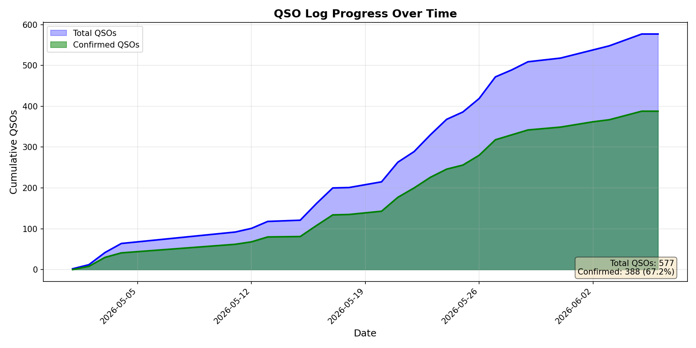

# myQRZlogs

Tools for managing and visualizing amateur radio QSO logs with QRZ.com integration.

**[Browse the logbook in Datasette Lite](https://lite.datasette.io/?url=https://payne.github.io/myQRZlogs/logbook.db)**



## Files

| File | Description |
|------|-------------|
| `logbook.adi` | ADIF logbook exported from SmartSDR |
| `logbook.db` | SQLite database generated from the ADIF file |
| `adi_to_sqlite.py` | Converts ADIF files to SQLite for analysis |
| `sync_qrz_confirmations.py` | Syncs QSL confirmation status from QRZ.com |
| `qso_graph.py` | Generates a graph of QSOs over time |

## Setup

1. Create a Python virtual environment:
   ```bash
   python3 -m venv venv
   source venv/bin/activate
   pip install matplotlib
   ```

2. Set up your QRZ API key (for confirmation sync):
   ```bash
   echo 'QRZ_API_KEY=your-api-key-here' > .env
   ```

   Get your API key from: QRZ.com → Settings → QRZ Logbook Settings → API Access

## Usage

### Import ADIF to SQLite

Convert your ADIF logbook to a SQLite database:

```bash
python3 adi_to_sqlite.py logbook.adi
```

This creates `logbook.db` which can be explored with tools like [Datasette](https://lite.datasette.io/).

### Sync Confirmations from QRZ

Fetch QSL confirmation status from your QRZ.com logbook:

```bash
python3 sync_qrz_confirmations.py
```

This updates the local database with confirmation data including:
- `qsl_rcvd` - Traditional QSL card received
- `lotw_qsl_rcvd` - LoTW confirmation received
- `app_qrzlog_qsldate` - QRZ logbook confirmation date

### Generate QSO Graph

Create a visualization of your QSO progress over time:

```bash
python3 qso_graph.py
```

This generates `qso_graph.png` showing cumulative total and confirmed QSOs.

## Typical Workflow

1. Export your logbook from SmartSDR as `logbook.adi`
2. Import to SQLite: `python3 adi_to_sqlite.py`
3. Sync confirmations: `python3 sync_qrz_confirmations.py`
4. Generate graph: `python3 qso_graph.py`
